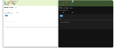

# Welcome to kurup!
<div align="center">
  
  <br/>
  <br/>
  
  
  
  
  
  *A simple, markdown-based note-taking application*
</div>

## ✨ Features

- **Markdown Support** - Write notes using simple markdown formatting
- **Live Preview**: See your formatted content instantly as you type.
- **Note Management** : View, edit, delete and download saved notes from within the app.
- **Image Embedding** - Paste images directly from your clipboard
- **Search Functionality** - Filter notes with a search term.
- **Local Storage** - All notes are stored locally in plain-text
- **Import** - Simply place markdown notes in kurup's notes folder
- **Export** - Download notes as zip files with images included
- **Simple Interface** - Simple, no-frills and lightweight

## 📸 Screenshots

<!-- Add your screenshots here -->
<div align="center">
  
</div>

## 💻 Usage

### Creating a Note

1. Open the "New" tab
2. Enter a title (optional)
3. Write your note content using markdown syntax
4. Press the "Save" button

#### Embedding Images

Simply paste images from your clipboard directly into the note area. Images are automatically:
- Displayed in the preview
- Stored locally with your note
- Included when you export the note

<div align="center">
  
</div>

### Managing Notes

In the "Saved" tab you can:
- **Preview** - Read your notes with formatted markdown
- **Raw** - View the raw markdown
- **Edit** - Make changes to existing notes
- **Delete** - Remove notes you no longer need (irreversible!)
- **Download** - Export individual notes as zip files (includes images)

<div align="center">
  
</div>


## 🚀 Getting Started

### Prerequisites

- Python 3.11 or higher

### Python

```bash
# Clone the repository
git clone https://github.com/davistdaniel/kurup
cd kurup

# Install dependencies
python -m pip install "nicegui>=2.17.0"

# Run the application
python main.py

# Open your web browser and navigate to:
http://localhost:9494
```

### Docker (using NiceGUI's docker image)
```bash
# Clone the repository
git clone https://github.com/davistdaniel/kurup
cd kurup

# start the container, you can edit docker-compose.yml to configure
sudo docker compose up -d

# Open your web browser and navigate to:
http://localhost:9494
```


## ⚙️ Configuration

Run with custom options:

```bash
python main.py --notes_dir 'custom_directory' --port 8080
```

Command-line arguments:
- `--notes_dir`: Specify where to store notes (default: "notes")
- `--port`: Set the app server port (default: 9494)

## 🔧 Project Structure

```
kurup/
├── main.py           # Main application file
├── static/           # Static assets (logo, favicon, JS etc.)
├── notes/            # Notes storage directory, contains an example note
└── utils/
    ├── fun.py                # Random label generation
    ├── image_handler.py      # Image processing module
    └── notes_handler.py      # Note management module
```

## 📝 Under the hood

kurup uses a simple approach to note management:

1. Notes are stored as markdown files in the `notes` directory
2. When images are pasted to clipboard, they are stored in the `temp` directory.
3. Images are copied from the `temp` directory to the `notes` directory when the note is saved.
4. A hidden `.kurup` metadata file tracks image references for each note.
5. The web interface is built with NiceGUI.

## 🤝 Contributing

Feel free to fork and contribute! Feature ideas or bug fixes are always welcome.

## 📜 License
This project is licensed under the terms of the GNU General Public License v3.0.

